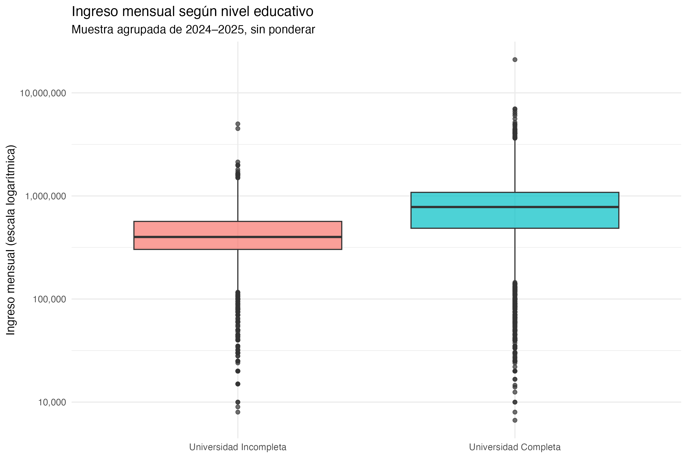
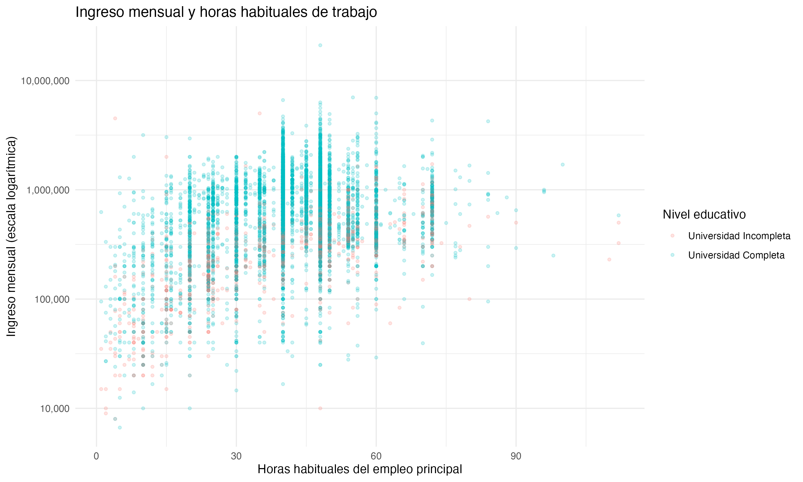
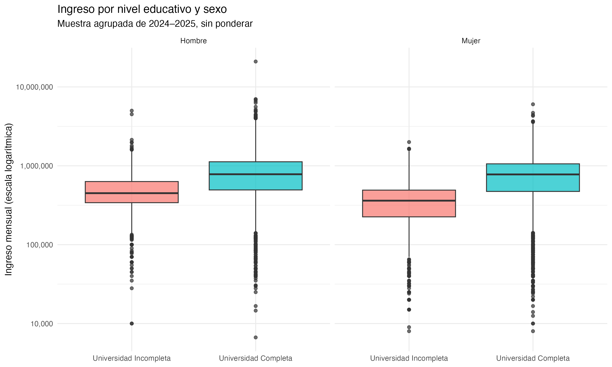
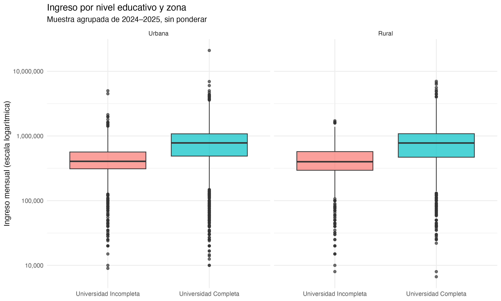

= Etapa 3: Análisis exploratorio de la brecha de ingresos
:lang: es
:encoding: utf-8
:toc: left
:toc-title: Contenido
:sectnums:
:imagesdir: .
:figure-caption: Figura
:table-caption: Tabla

Universidad completa e incompleta · Periodo 2024–2025

== Objetivo y alcance

Comparar el ingreso mensual del empleo principal entre personas con universidad completa e incompleta y explorar su relación con las horas habituales de trabajo, el sexo y la zona de residencia.

El análisis utiliza la base preparada en las etapas 1 y 2 y reúne *16 034 observaciones*: 13 387 con universidad completa y 2 647 con universidad incompleta. Se presentan resultados de la muestra agrupada, *sin ponderadores*. El número de observaciones no debe interpretarse automáticamente como el número de personas únicas entre trimestres.

== Estadísticas descriptivas

.Ingreso mensual por nivel educativo; valores redondeados
[cols="3,>2,>2,>2,>2",options="header"]
|===
|Nivel educativo |Observaciones |Media |Mediana |Desviación estándar
|Universidad incompleta |2 647 |457 726 |400 000 |289 431
|Universidad completa |13 387 |840 218 |781 025 |541 596
|===

El ingreso medio del grupo con universidad completa supera al del grupo con universidad incompleta en aproximadamente *382 492 unidades monetarias*, equivalente a un *83,6 %* respecto al promedio del segundo grupo.

La mediana también es mayor para universidad completa: 781 025 frente a 400 000. Por tanto, la diferencia no aparece únicamente en el promedio. En ambos grupos, la media supera a la mediana, lo que sugiere asimetría hacia ingresos altos. La desviación estándar muestra mayor dispersión absoluta en el grupo con universidad completa.

== Comparación general de ingresos

.Distribución del ingreso por nivel educativo

La caja y la mediana del grupo con universidad completa se ubican por encima de las del grupo con universidad incompleta. Esto evidencia una diferencia descriptiva a favor del primer grupo, aunque las distribuciones se superponen: tener universidad completa no implica que cada observación tenga un ingreso superior al de todas las observaciones del otro grupo.

Se observan valores extremos altos y bajos en ambos grupos. Estos puntos requieren revisión, pero su posición fuera de los bigotes no demuestra que sean errores ni justifica eliminarlos automáticamente.

NOTE: Los gráficos utilizan una escala logarítmica en el eje del ingreso. Las distancias verticales representan relaciones proporcionales, no diferencias monetarias constantes. La tabla conserva los ingresos en su escala original.

== Relación entre horas e ingreso

.Ingreso mensual y horas habituales del empleo principal

Visualmente, los ingresos tienden a aumentar al pasar de jornadas cortas a jornadas cercanas a 40–48 horas. Sin embargo, existe una dispersión considerable para una misma cantidad de horas, y las jornadas más extensas no presentan necesariamente los ingresos más altos.

La nube de puntos sugiere que las horas habituales no explican por sí solas las diferencias de ingreso. La superposición y el mayor tamaño del grupo con universidad completa limitan la comparación visual; este gráfico no estima una brecha ajustada por horas.

== Comparación por sexo

.Ingreso por nivel educativo dentro de cada sexo

Tanto entre hombres como entre mujeres, la mediana es mayor para quienes tienen universidad completa. La separación entre niveles educativos parece más marcada entre las mujeres: en universidad incompleta su mediana es menor que la de los hombres, mientras que en universidad completa las medianas de ambos sexos son visualmente similares.

Esta observación es exploratoria. Para cuantificar las diferencias entre subgrupos o determinar si son estadísticamente significativas se necesitan cálculos adicionales.

== Comparación por zona

.Ingreso por nivel educativo dentro de cada zona

La diferencia a favor de universidad completa se observa tanto en la zona urbana como en la rural. Las medianas de cada nivel educativo son visualmente parecidas entre zonas. Por ello, el gráfico no muestra un contraste territorial marcado en el centro de las distribuciones; esto no equivale a demostrar igualdad entre zonas.

== Conclusión y transición a la etapa 4

El análisis exploratorio es consistente con la hipótesis de mayores ingresos asociados con universidad completa. La diferencia se aprecia en la media, la mediana y las comparaciones por sexo y zona. A su vez, la variación del ingreso entre observaciones con horas similares motiva la incorporación de otros controles.

Estos resultados no establecen causalidad ni significancia estadística. La etapa 4 evaluará cuánto de la diferencia persiste al controlar simultáneamente por horas trabajadas, sexo, edad, zona y rama de actividad.

IMPORTANT: Antes de presentar resultados definitivos, el equipo debe verificar el filtro de ocupación de la etapa 2: la búsqueda parcial de `ocupad` también puede coincidir con `desocupado`. Es necesario confirmar que la base incluya exclusivamente la población objetivo. El análisis actual está condicionado a esa validación.

== Guion breve para exponer

. “Comparamos los ingresos de ambos niveles educativos con una muestra agrupada de 2024 y 2025, sin ponderar.”
. “El ingreso promedio es aproximadamente 83,6 % mayor en universidad completa; la mediana también es superior.”
. “La diferencia educativa aparece tanto en hombres como en mujeres y en ambas zonas.”
. “Las horas de trabajo muestran una relación visual con el ingreso, pero existe mucha variación entre jornadas similares.”
. “Estos son hallazgos descriptivos. La regresión de la etapa 4 permitirá evaluar la diferencia al incorporar los controles.”

== Archivos y reproducción

El script `script_project_part03.R` carga `Datos_Limpios_Brecha_Salarial.rds` y genera la tabla y los gráficos. Para ejecutarlo desde una sesión de R ubicada en la carpeta del proyecto:

[source,r]
----
source("script_project_part03.R")
----

Para compartir o visualizar este documento desde el repositorio, conserva `Analisis_Etapa3.adoc` y los cuatro archivos PNG enlazados en la raíz del proyecto. Incluye el documento y esos gráficos en Git.
